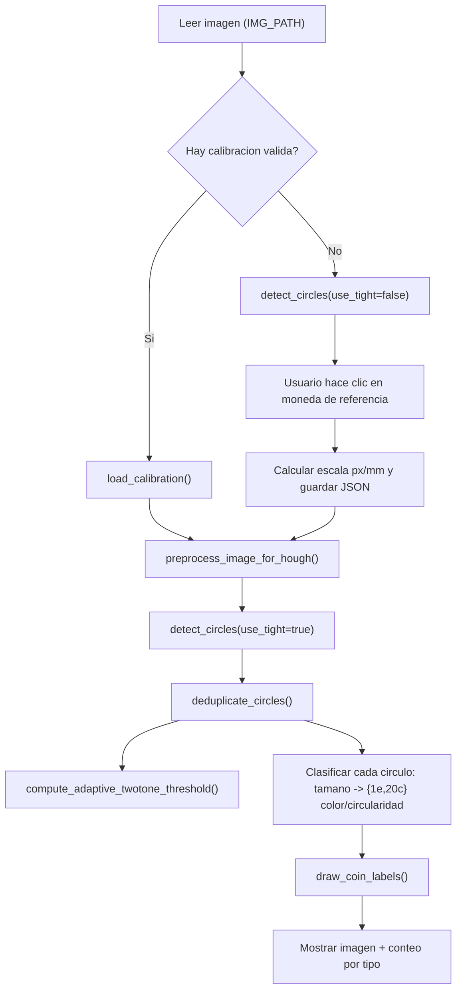
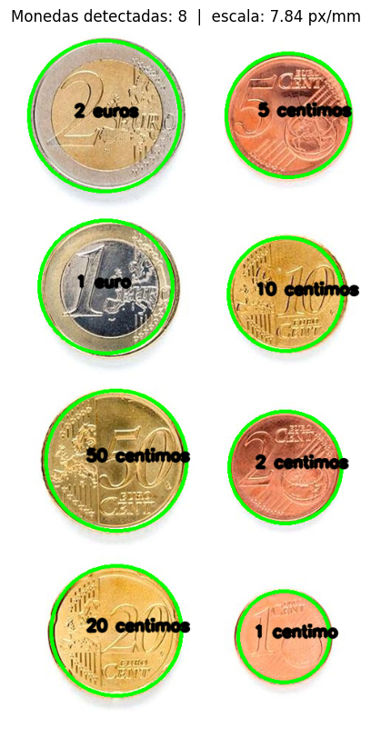
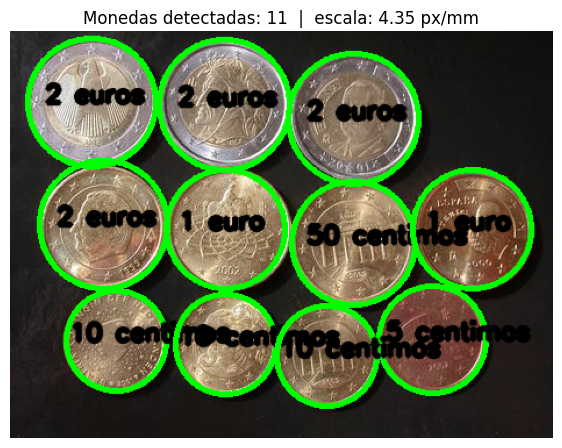
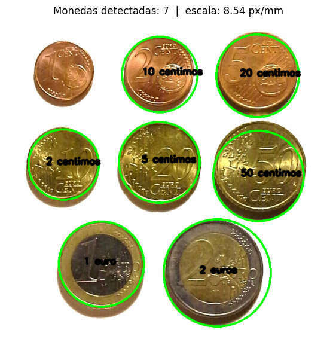
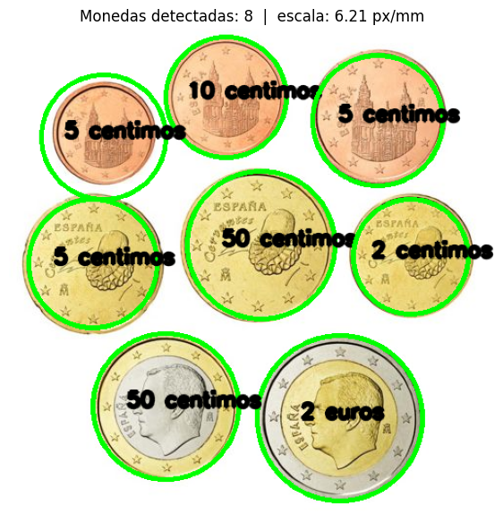
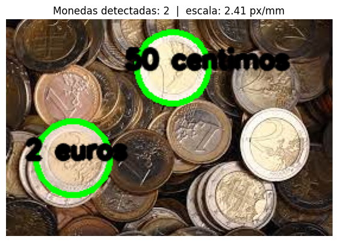
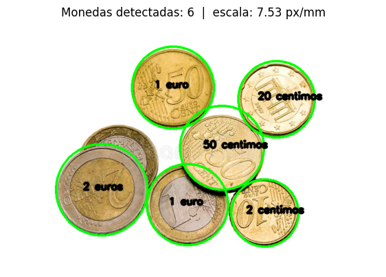
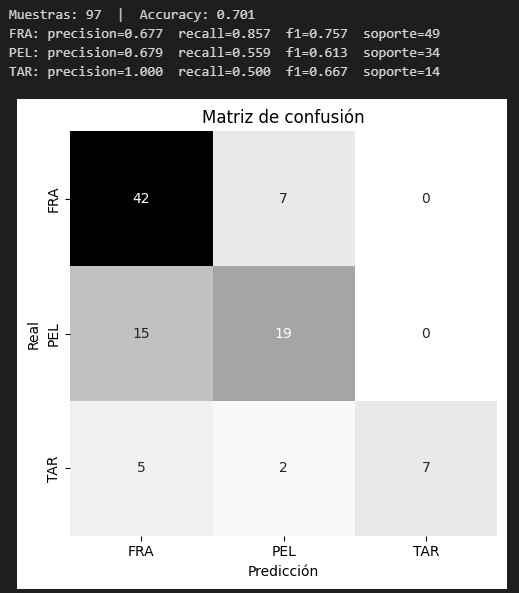
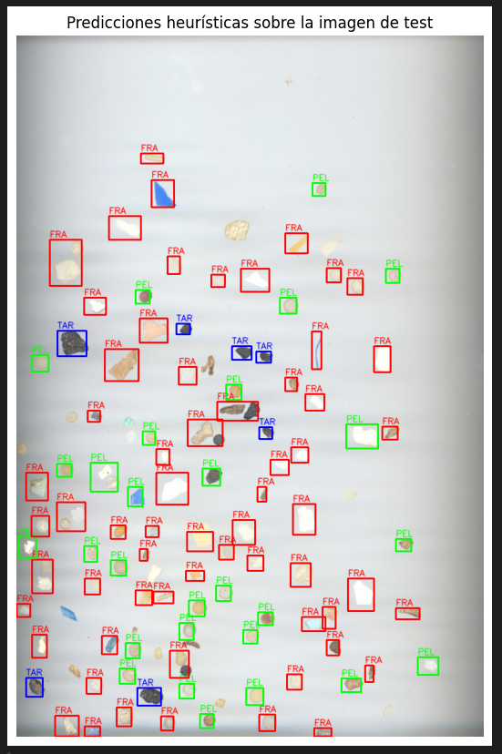

<div style="center">

[]()

---
<div style="center">

[](https://github.com/lumusa2design/Computer-Visualization/blob/main/prac1/VC_P1.ipynb)

</div>


---


</div>


# Práctica 3 de la asignatura Visión por computador.

<details>
<summary><b>📚 Tabla de contenidos</b></summary>


</details>


## Tarea 1:Los ejemplos ilustrativos anteriores permiten saber el número de monedas presentes en la imagen. ¿Cómo saber la cantidad de dinero presente en ella? Sugerimos identificar de forma interactiva (por ejemplo haciendo clic en la imagen) una moneda de un valor determinado en la imagen (por ejemplo de 1€). Tras obtener esa información y las dimensiones en milímetros de las distintas monedas, realiza una propuesta para estimar la cantidad de dinero en la imagen. Muestra la cuenta de monedas y dinero sobre la imagen. No hay restricciones sobre utilizar medidas geométricas o de color.  
## Una vez resuelto el reto con la imagen ideal proporcionada, captura una o varias imágenes con monedas. Aplica el mismo esquema, tras identificar la moneda del valor determinado, calcula el dinero presente en la imagen. ¿Funciona correctamente? ¿Se observan problemas?

## Nota: Para establecer la correspondencia entre píxeles y milímetros, comentar que la moneda de un euro tiene un diámetro de 23.25 mm. la de 50 céntimos de 24.35, la de 20 céntimos de 22.25, etc. 

## Extras: Considerar que la imagen pueda contener objetos que no son monedas y/o haya solape entre las monedas. Demo en vivo. 

Sobre este primer ejercicio hemos planteado el paradigma sugerido en la tarea, aunque originalmente, para la imagen ideal, se calculaba de forma no-dinámica. Probamos con diferentes imagenes para ver el resultado y esto fallaba, al no tener la misma escala.

Nuestra resolución ha sido guardar en un JSON la calibración (esto con el fin de que el programa pueda tener aplicaciones reales y bastaría con mover a otra celda el codigo que contiene la eliminación o encapsularlo en una función).

Ahor vamos a ir desglosando el código poco a poco:

### Parámetros globales y ajustes

Hemos añadido diferentes constantes que controlan las entradas, la depuración y los elementos del *transform* del Hough. Podemos poner por asi decirlo, tres categorías:
 - **HOUGH**: Sensibilidad del Hough y rango de radios relativos al tamaño de la imagen.
 - **DEDUP**: Los diferentes criterios que hemos usado para fusionar las detecciones casi identicas cercanas.
 - **TWOTONE y CIRC_THRESHOLD**: Umbrales para detectar monedas bicolores y usar la circularidad de la moneda como forma de diferenciar.

 ```python
 import cv2
import json
import numpy as np
import matplotlib.pyplot as plt
from pathlib import Path
import os 
IMG_PATH = "Monedas.jpg"
CALIB_JSON = "calibracion.json"
COIN_REF = "2 euros"
USE_MPL = False       
SHOW_DEBUG = True
HOUGH_DP = 1.2
HOUGH_PARAM1 = 120
HOUGH_PARAM2 = 50    
HOUGH_MINDIST_F = 0.20  
HOUGH_MINR_F_TIGHT = 0.11
HOUGH_MAXR_F_TIGHT = 0.22
HOUGH_MINR_F_LOOSE = 0.05
HOUGH_MAXR_F_LOOSE = 0.30
HOUGH_MINDIST_F_LOOSE = 0.12
DEDUP_DIST_FRAC = 0.6
DEDUP_RAD_FRAC  = 0.25
TWOTONE_B_THRESH = 6.0    
TWOTONE_LAB_THRESH = 10.0 
CIRC_THRESHOLD = 0.93  
 ```
### Clasificación de monedas con sus diametros oficiales

Mapea através de un diccionario el nombre con su respectivo radio en milímetros.

Se usa el orden para decidir el más cercano en tamaño.

```python
COINS_DIAM_MM = [
    ('1 centimo', 16.25),
    ('2 centimos', 18.75),
    ('10 centimos', 19.75),
    ('5 centimos', 21.25),
    ('20 centimos', 22.25),
    ('1 euro', 23.25),
    ('50 centimos', 24.25),
    ('2 euros', 25.75),
]
COINS_RAD_MM = {name: diam / 2.0 for name, diam in COINS_DIAM_MM}
COIN_ORDER = [name for name, _ in COINS_DIAM_MM]
```
### Preprocesado para Hough

Convierte a escala de grises la imagen y aplica un desenfoque mediante la mediana y una ecualización del histograma para realzar los bordes y contraste de la imagen, facilitando la visualización.

```python
def preprocess_image_for_hough(image_bgr):
    gray = cv2.cvtColor(image_bgr, cv2.COLOR_BGR2GRAY)
    return gray, cv2.equalizeHist(cv2.medianBlur(gray, 7))
```

### Detección de círculos usando Hough

- Ajusta el *min/max* radio y distanca mínima en función del tamaño de la imagen
- devuelve círculos como `int`: *(x, y, r)* 

```python
def detect_circles(preprocessed, use_tight=True):
    height, width = preprocessed.shape[:2]
    if use_tight:
        min_radius = int(min(height, width) * HOUGH_MINR_F_TIGHT)
        max_radius = int(min(height, width) * HOUGH_MAXR_F_TIGHT)
        min_dist = int(min(height, width) * HOUGH_MINDIST_F)
    else:
        min_radius = int(min(height, width) * HOUGH_MINR_F_LOOSE)
        max_radius = int(min(height, width) * HOUGH_MAXR_F_LOOSE)
        min_dist = int(min(height, width) * HOUGH_MINDIST_F_LOOSE)
    circles = cv2.HoughCircles(preprocessed, cv2.HOUGH_GRADIENT, dp=HOUGH_DP, minDist=min_dist, param1=HOUGH_PARAM1, param2=HOUGH_PARAM2, minRadius=min_radius, maxRadius=max_radius)
    if circles is None:
        return np.empty((0, 3), dtype=int)
    return np.round(circles[0]).astype(int)
```

### Eliminación de círculos duplicados

Recorre todas las detecciones y fusiona las que estén muy cerca y tienen un radio muy similar.

Se queda con la detección de mayor radiodel grupo.

```python
def deduplicate_circles(circles, distance_fraction=DEDUP_DIST_FRAC, radius_fraction=DEDUP_RAD_FRAC):
    if circles is None or len(circles) == 0:
        return circles
    items = circles.astype(float).tolist()
    used = [False] * len(items)
    result = []
    for i, (x1, y1, r1) in enumerate(items):
        if used[i]:
            continue
        best = (x1, y1, r1)
        for j, (x2, y2, r2) in enumerate(items):
            if j <= i or used[j]:
                continue
            d = np.hypot(x1 - x2, y1 - y2)
            if d < distance_fraction * min(r1, r2) and abs(r1 - r2) < radius_fraction * min(r1, r2):
                if r2 > best[2]:
                    best = (x2, y2, r2)
                used[j] = True
        used[i] = True
        result.append(best)
    return np.array(np.round(result), dtype=int)
```
### Selección de moneda

Debido a algún tipo de incompatibilidad en nuestro entorno virtual, nos hemos visto obligados a usar dos interfaces de dos librerías diferentes. Una usando la de OpenCV y otra la propia de matplotlib. 

Posteriormente, arreglamos el problema, pero por si sucediera en un futuro a la hora de testearlo, hemos dejado las dos opciones.

#### Opción de OpenCV

Díbuja los índices, espera  que el usuario haga click en la moneda de calibración, marca el círculo más cercano y lo devuelve

```python
def select_circle_with_click_cv(image_bgr, circles):
    prompt = "Haz clic sobre la moneda de referencia"
    if circles.size == 0:
        raise RuntimeError("No hay círculos para seleccionar.")
    display = image_bgr.copy()
    for i, (x, y, r) in enumerate(circles):
        cv2.circle(display, (x, y), r, (0, 255, 0), 2)
        cv2.putText(display, f"#{i}", (x - 10, y - 10), cv2.FONT_HERSHEY_SIMPLEX, 0.6, (0, 0, 255), 2, cv2.LINE_AA)
    banner = display.copy()
    h, w = display.shape[:2]
    pad, bar_h = 12, 40
    cv2.rectangle(banner, (0, 0), (w, bar_h + 2 * pad), (0, 0, 0), -1)
    display = cv2.addWeighted(banner, 0.35, display, 0.65, 0.0)
    cv2.putText(display, prompt, (10, 25 + pad // 2), cv2.FONT_HERSHEY_SIMPLEX, 0.7, (255, 255, 255), 2, cv2.LINE_AA)
    selection = {"pt": None}
    def on_mouse(event, mx, my, *_):
        if event == cv2.EVENT_LBUTTONDOWN:
            selection["pt"] = (mx, my)
    cv2.namedWindow("Calibracion", cv2.WINDOW_NORMAL)
    cv2.imshow("Calibracion", display)
    cv2.setMouseCallback("Calibracion", on_mouse)
    while True:
        key = cv2.waitKey(20) & 0xFF
        if selection["pt"] is not None:
            break
        if key == 27:
            cv2.destroyWindow("Calibracion")
            raise KeyboardInterrupt("Calibración cancelada por el usuario.")
    mx, my = selection["pt"]
    centers = circles[:, :2].astype(float)
    idx = int(np.argmin(np.linalg.norm(centers - np.array([[mx, my]]), axis=1)))
    x, y, r = tuple(circles[idx])
    cv2.circle(display, (x, y), r, (255, 0, 0), 3)
    cv2.circle(display, (mx, my), 5, (255, 0, 0), -1)
    cv2.imshow("Calibracion", display)
    cv2.waitKey(600)
    cv2.destroyWindow("Calibracion")
    return x, y, r
```

#### Opción con matplotlib

Muestra la imagen y los círculos y con el input recoge el círculo más cercano.

```python
def select_circle_with_click_mpl(image_bgr, circles):
    prompt = "Haz clic sobre la moneda de referencia"
    if circles.size == 0:
        raise RuntimeError("No hay círculos para seleccionar.")
    image_rgb = cv2.cvtColor(image_bgr, cv2.COLOR_BGR2RGB)
    fig, ax = plt.subplots(figsize=(6, 8))
    ax.imshow(image_rgb)
    ax.set_title(prompt)
    ax.axis('off')
    for i, (x, y, r) in enumerate(circles):
        ax.add_patch(plt.Circle((x, y), r, fill=False, linewidth=2))
        ax.text(x, y, f"#{i}", fontsize=10, color='r')
    plt.tight_layout()
    pts = plt.ginput(1, timeout=0)
    plt.close(fig)
    if not pts:
        raise KeyboardInterrupt("Calibración cancelada por el usuario.")
    mx, my = pts[0]
    centers = circles[:, :2].astype(float)
    return tuple(circles[int(np.argmin(np.linalg.norm(centers - np.array([[mx, my]]), axis=1)))])
```

### Calculo y guardado de escala
El usuario la moneda que se usará como referencia
Calcula la relación y escala de *px/pmm* y se guarda en `calibracion.json` junto con el tamaño de la imagen.
```python
def calibrate_pixel_scale(image_bgr, reference_coin_name, calib_json=CALIB_JSON, use_mpl=USE_MPL):
    if reference_coin_name not in COINS_RAD_MM:
        raise ValueError(f"Moneda '{reference_coin_name}' no reconocida. Opciones: {list(COINS_RAD_MM.keys())}")
    _, preprocessed = preprocess_image_for_hough(image_bgr)
    circles = deduplicate_circles(detect_circles(preprocessed, use_tight=False))
    if circles.size == 0:
        raise RuntimeError("No se detectaron círculos en calibración. Ajusta parámetros de Hough.")
    picker = select_circle_with_click_mpl if use_mpl else select_circle_with_click_cv
    r_px = float(picker(image_bgr, circles)[2])
    r_mm = COINS_RAD_MM[reference_coin_name]
    scale_px_per_mm = r_px / r_mm
    h, w = image_bgr.shape[:2]
    payload = {"image_size": [h, w], "coin_name": reference_coin_name, "scale_px_per_mm": scale_px_per_mm}
    Path(calib_json).write_text(json.dumps(payload, indent=2), encoding="utf-8")
    return scale_px_per_mm
```
### Carga calibración
Dado que enfocamos este ssitema a un posible caso de uso real, cargamos del jso que servirá de referencia para la calibración.

```python
def load_calibration(calib_json, expected_size=None):
    path = Path(calib_json)
    if not path.exists():
        return None
    try:
        data = json.loads(path.read_text(encoding="utf-8"))
    except Exception:
        return None
    if expected_size and tuple(data.get("image_size", [])) != tuple(expected_size):
        return None
    return data.get("scale_px_per_mm", None)
```
Además sevalida que los tamaños coinciden.

### Rasgos de color y brillo

Usa una máscara anti brillos usando V alto y S bajo

Compara anillos internos con externos para determinar monedas de por ejemplo 1 y 2 euros.

```python
def extract_coin_color_features_lab(image_bgr, circle, inner_frac=0.55, ring_in=0.65, ring_out=0.95, trim=0.15, glare_V=0.88, glare_S=0.22):
    x, y, r = map(int, circle)
    h, w = image_bgr.shape[:2]
    r = max(5, min(r, min(x, w - 1 - x, y, h - 1 - y)))
    x0, x1 = max(0, x - r), min(w, x + r + 1)
    y0, y1 = max(0, y - r), min(h, y + r + 1)
    roi = image_bgr[y0:y1, x0:x1]
    if roi.size == 0:
        return None
    lab = cv2.cvtColor(roi, cv2.COLOR_BGR2LAB)
    hsv = cv2.cvtColor(roi, cv2.COLOR_BGR2HSV)
    yy, xx = np.ogrid[:lab.shape[0], :lab.shape[1]]
    cx, cy = x - x0, y - y0
    dist = np.sqrt((xx - cx) ** 2 + (yy - cy) ** 2)
    mask_inner = dist <= (inner_frac * r)
    mask_ring = (dist >= (ring_in * r)) & (dist <= (ring_out * r))
    V = hsv[:, :, 2].astype(np.float32) / 255.0
    S = hsv[:, :, 1].astype(np.float32) / 255.0
    glare_mask = ~((V >= glare_V) & (S <= glare_S))
    def robust_stats(mask):
        mask = mask & glare_mask
        if not np.any(mask):
            return (np.nan, np.nan, np.nan)
        sel = lab[mask].astype(np.float32)
        def trimmed_median(col):
            if col.size == 0:
                return np.nan
            lo = np.quantile(col, trim)
            hi = np.quantile(col, 1.0 - trim)
            col = col[(col >= lo) & (col <= hi)]
            return float(np.median(col)) if col.size > 0 else np.nan
        L = trimmed_median(sel[:, 0])
        a = trimmed_median(sel[:, 1])
        b = trimmed_median(sel[:, 2])
        return (L, a, b)
    Lin, ain, bin_ = robust_stats(mask_inner)
    Lrg, arg, brg = robust_stats(mask_ring)
    delta_b = abs(brg - bin_)
    delta_a = abs(arg - ain)
    delta_lab = float(np.sqrt((Lrg - Lin) ** 2 + (arg - ain) ** 2 + (brg - bin_) ** 2))
    signed_db = float(brg - bin_)
    return {"inner": (Lin, ain, bin_), "ring": (Lrg, arg, brg), "delta_b": delta_b, "delta_a": delta_a, "delta_lab": delta_lab, "signed_db": signed_db}
```

### Medida de cercanía a circulo (circularidad)

Comprueba la cercanía de la figura captada como un círculo a un círculo real. Esto es porque daba errores muchas veces de círculos que no existían.

Si el valor es muy cercano  1 es que es muy circular.

```python
def compute_coin_circularity(image_gray, circle, canny1=80, canny2=160):
    x, y, r = map(int, circle)
    h, w = image_gray.shape[:2]
    x0, x1 = max(0, x - r - 3), min(w, x + r + 4)
    y0, y1 = max(0, y - r - 3), min(h, y + r + 4)
    roi = image_gray[y0:y1, x0:x1]
    if roi.size == 0:
        return np.nan
    edges = cv2.Canny(roi, canny1, canny2)
    contours, _ = cv2.findContours(edges, cv2.RETR_EXTERNAL, cv2.CHAIN_APPROX_SIMPLE)
    if not contours:
        return np.nan
    cx, cy = x - x0, y - y0
    best_circularity, best_area = np.nan, 0
    for cnt in contours:
        area = cv2.contourArea(cnt)
        if area < 50:
            continue
        per = cv2.arcLength(cnt, True)
        if per <= 0:
            continue
        circularity = 4 * np.pi * area / (per * per)
        M = cv2.moments(cnt)
        if M["m00"] == 0:
            continue
        mx, my = int(M["m10"] / M["m00"]), int(M["m01"] / M["m00"])
        if np.hypot(mx - cx, my - cy) < 0.25 * r and area > best_area:
            best_area = area
            best_circularity = circularity
    return float(best_circularity)
```

### Umbral adaptativo de dos tonos

Hace al clasificado menos sensible al conjunto de la iluminación percibida en cada foto.

```python
def compute_adaptive_twotone_threshold(image_bgr, circles, default_b=TWOTONE_B_THRESH):
    values = []
    for circle in circles:
        feats = extract_coin_color_features_lab(image_bgr, circle)
        if feats is None or np.isnan(feats["delta_b"]):
            continue
        values.append(feats["delta_b"])
    if len(values) < 3:
        return default_b
    v = np.array(values, dtype=np.float32)
    v = v[np.isfinite(v)]
    if v.size < 3:
        return default_b
    v = np.clip(v, 0, np.percentile(v, 99.5))
    vmax = v.max() + 1e-6
    v8 = (v / vmax * 255).astype(np.uint8).reshape(-1, 1)
    thr8, _ = cv2.threshold(v8, 0, 255, cv2.THRESH_BINARY + cv2.THRESH_OTSU)
    thr = float(thr8 / 255.0 * vmax)
    return max(thr, default_b * 0.7)
```
### El valor más cercano

Devuelve el índice más cercano al valor obtenido
```python
def nearest_index(value, array):
    array = np.asarray(array, dtype=float)
    return int(np.argmin(np.abs(array - value)))
```
### Clasificación de la moneda

Gracias a toos los valores obtenidos en el resto de funciones se puede clasificar la moneda gracias a los parámetros. Atendiendo al siguiente orden.

<ol>
    <li>Calcula la moneda gracias al escalado con un escalado</li>
    <li>Busca el radio más cercano</li>
    <li>Si es una moneda de 20 centimos o 1 euro usa el color para comprobar si tiene dos tonos y la diferencia</li>
    <li>Devuelve la moneda</li>
</ol>

Hemos tenido que hacer la diferencia de 1 € y 20 céntimos debido a que, el radio es muy cercano y en muchas imágenes daba error.

```python
def classify_coin(image_bgr, image_gray, circle, scale_px_per_mm, two_tone_b_thresh=None, two_tone_lab_thresh=TWOTONE_LAB_THRESH, circ_thresh=CIRC_THRESHOLD):
    if two_tone_b_thresh is None:
        two_tone_b_thresh = TWOTONE_B_THRESH
    x, y, r_px = circle
    r_mm = r_px / scale_px_per_mm
    candidate_radii = [COINS_RAD_MM[n] for n in COIN_ORDER]
    idx = nearest_index(r_mm, candidate_radii)
    nearest_name = COIN_ORDER[idx]
    diffs = np.abs(np.array(candidate_radii) - r_mm)
    second = np.argsort(diffs)[1] if len(diffs) > 1 else idx
    second_name = COIN_ORDER[second]
    if {nearest_name, second_name} == {"20 centimos", "1 euro"}:
        color = extract_coin_color_features_lab(image_bgr, circle)
        circularity = compute_coin_circularity(image_gray, circle)
        two_tone = False
        if color is not None and np.isfinite(color["delta_b"]):
            two_tone = (color["delta_b"] > two_tone_b_thresh) or (color["delta_lab"] > two_tone_lab_thresh)
            if two_tone and np.isfinite(color["signed_db"]) and color["signed_db"] < 0:
                two_tone = (color["delta_lab"] > (two_tone_lab_thresh + 2.0))
        if two_tone:
            name = "1 euro"
        else:
            if not np.isnan(circularity) and circularity < circ_thresh:
                name = "20 centimos"
            else:
                name = nearest_name
    else:
        name = nearest_name
    return name, r_mm
```

### Dibujo del contorno y las etiquetas
Esta función dibuja el contorno de las monedas y muestra el valor de ellas encima.

```python

def draw_coin_labels(image_bgr, labels):
    out = cv2.cvtColor(image_bgr, cv2.COLOR_BGR2RGB)
    for x, y, r, name, _ in labels:
        cv2.circle(out, (x, y), r, (0, 255, 0), 3)
        cv2.putText(out, name, (x - 40, y), cv2.FONT_HERSHEY_SIMPLEX, 0.7, (0, 0, 0), 3, cv2.LINE_AA)
    return out
```

### Pipeline principal

Flujo del programa para que funcione, en un futuro se podría separar la eliminaciñon del json
```python
if __name__ == "__main__":
    image = cv2.imread(IMG_PATH)
    h, w = image.shape[:2]
    scale = load_calibration(CALIB_JSON, expected_size=(h, w))
    if scale is None:
        scale = calibrate_pixel_scale(image, COIN_REF, calib_json=CALIB_JSON, use_mpl=USE_MPL)
    image_gray, preprocessed = preprocess_image_for_hough(image)
    circles = deduplicate_circles(detect_circles(preprocessed))
    two_tone_b_adapt = compute_adaptive_twotone_threshold(image, circles)
    count_by_type = {n: 0 for n, _, _ in COINS_DIAM_MM}
    labels = []
    for x, y, rpx in circles:
        name, r_mm = classify_coin(image, image_gray, (x, y, rpx), scale, two_tone_b_thresh=two_tone_b_adapt)
        count_by_type[name] += 1
        labels.append((x, y, rpx, name, r_mm))
    vis = draw_coin_labels(image, labels)
    plt.figure(figsize=(7, 10))
    plt.axis("off")
    plt.title(f"Monedas detectadas: {len(circles)}  |  escala: {scale:.2f} px/mm")
    plt.imshow(vis)
    plt.show()
    total = 0.0
    total = 0.0
    for k in COIN_ORDER:
        print(f"{k}: {count_by_type[k]}")
        total += count_by_type[k] * COIN_VALUE[k]
    print(f"Total: {total:.2f} euros")
    if Path(CALIB_JSON).exists():
        os.remove(CALIB_JSON)
```



### Usos aplicados

#### Caso 1: El caso Básico



Como podemos ver en este caso ha acertado el 100% de las veces. Esto se debe a que es la imgen ideal, sin ruido de fondo y a una muy buena resolución.

#### Caso 2: Poco espacio entre monedas y con brillos difusos



En este caso, la moneda de 50 centimos puede confundirse con la de 1€ porque ambas disponen de un doble anillo, rompiendo nuestro algoritmo para evitar los dobles tonos, además de que la iluminación y el fondo no es ideal, provocando más errores, y una leve inclinación que genera perspectiva.

Igualmente, la mayoría de monedas ha sido capaz de diferenciarlas bien.

#### Caso 3: Sombras que deforman la imagen



En este caso la sombra deforma bastante el radio de la imagen haciendo que las monedas parezcan más grandes de lo que son, esto provoca que algunas monedas ni si quierase reconozcan como un círculo y además el brillo genera cierto brillo en su reflexión, dificultando el proceso de clasificación.

La moneda de 2 euros en este caso, no esta uniformemente iluminada respecto al resto de monedas y por eso se genera el error.

#### Caso 4: Monedas con dimesniones desproporcionadas



En este caso, las monedas no tienen una proporción real, siendo la moneda de 5 céntimos de un tamaño bastante mayor a la de 10 centimos y a su vez, el brillo genera ruido y hace que monedas más pequeñas parezcan grandes.

#### Caso 5: Monedas super solapadasy en baja calidad



En este caso las monedas no se logran diferenciar porque la imagen tiene muy baja calidad detectando pocos círculos, además de no siendo capaz de clasificar bien la imagen por el brillo puesto sobre la imagen.

#### Caso 6: Monedas superpuestas



En este caso si ha sido capaz de diferenciar relativamente bien entre las monedas incluso superponiendose una encima de otra, aunque, hay una que ha detectado por nuestro método para comprobar la circularidad (en la selección de moneda si lo detecto).

# TAREA2

TAREA: La tarea consiste en extraer características (geométricas y/o visuales) de las tres imágenes completas de partida, y *aprender* patrones que permitan identificar las partículas en nuevas imágenes. Para ello se proporciona como imagen de test *MPs_test.jpg* y sus correpondientes anotaciones *MPs_test_bbs.csv* con la que deben obtener las métricas para su propuesta de clasificación de microplásticos, además de la matriz de confusión. La matriz de confusión permitirá mostrar para cada clase el número de muestras que se clasifican correctamente de dicha clase, y el número de muestras que se clasifican incorrectamente como perteneciente a una de las otras dos clases.

En el trabajo [SMACC: A System for Microplastics Automatic Counting and Classification](https://doi.org/10.1109/ACCESS.2020.2970498), las características geométricas utilizadas fueron:

- Área en píxeles
- Perímetro en píxeles
- Compacidad (relación entre el cuadrado del perímetro y el área de la partícula)
- Relación del área de la partícula con la del contenedor
- Relación del ancho y el alto del contenedor
- Relación entre los ejes de la elipse ajustada
- Definido el centroide, relación entre las distancias menor y mayor al contorno

Si no se quedan satisfechos con la segmentación obtenida, es el mundo real, también en el README comento técnicas recientes de segmentación, que podrían despertar su curiosidad.

#  Clasificador heurístico de microplásticos (FRA, PEL, TAR)
En este ejercicio clasificamos partículas en FRA (fragmentos), PEL (pellets) y TAR (alquitrán) usando solo heurísticas (reglas) basadas en características geométricas y de apariencia.
Se “entrena” aprendiendo umbrales a partir de las tres imágenes de clase (FRA.png, PEL.png, TAR.png), y evalúa en la imagen MPs_test.jpg con sus anotaciones MPs_test_bbs.csv.

## 1. Importaciones
Importamos las correspondientes librerías para trabajar en el ejercicio 
````python
import  math
import numpy as np, pandas as pd
import cv2, matplotlib.pyplot as plt, seaborn as sns
from sklearn.metrics import confusion_matrix, accuracy_score, precision_recall_fscore_support
````
Numpy y pandas para manejo numérico y de tablas, cv2 (OpenCV) para procesado de imagen, matplotlib y seaborn para los gráficos y la matriz de confusión y sklearn.metrics para métricas de clasificación (precisión, recall, f1score). 

## 2. Parámetros a ajustar
````python
MARGIN_TAR   = 0.45   # sesgo a favor de TAR al aprender umbrales
MARGIN_PEL   = 0.30   # sesgo a favor de PEL al aprender umbrales
V_DARK_THR   = 65     # umbral de “pixel muy oscuro” en el canal V (HSV)
ASPECT_DELTA = 0.35   # tolerancia del aspect ratio (≈1±delta) para pellets
````
MARGIN_TAR / MARGIN_PEL: se suman/restan a los umbrales aprendidos para separar más las clases. Si subes MARGIN_TAR, el clasificador será más propenso a etiquetar TAR.

V_DARK_THR: un píxel se considera “muy oscuro” si V < V_DARK_THR.

ASPECT_DELTA: cuánto puede alejarse el ancho/alto de 1 y seguir considerarse redondo (para pellets).


## 3. Segmentación
````python
def clean_mask(mask, open_ksize=3, close_ksize=3, it_open=1, it_close=2):
    k1 = cv2.getStructuringElement(cv2.MORPH_ELLIPSE, (open_ksize, open_ksize))
    k2 = cv2.getStructuringElement(cv2.MORPH_ELLIPSE, (close_ksize, close_ksize))
    mask = cv2.morphologyEx(mask, cv2.MORPH_OPEN,  k1, iterations=it_open)  # elimina ruido fino
    mask = cv2.morphologyEx(mask, cv2.MORPH_CLOSE, k2, iterations=it_close) # cierra agujeros
    return mask
````
Limpia la máscara binaria: apertura quita puntos sueltos; cierre rellena huecos.

````python
def best_binary_mask(gray):
    blur = cv2.GaussianBlur(gray, (5,5), 0)  # suaviza ruido
    _, th_bin = cv2.threshold(blur, 0, 255, cv2.THRESH_BINARY + cv2.THRESH_OTSU)
    _, th_inv = cv2.threshold(blur, 0, 255, cv2.THRESH_BINARY_INV + cv2.THRESH_OTSU)
    th_bin, th_inv = clean_mask(th_bin), clean_mask(th_inv)

    def largest_area(m):
        cnts,_ = cv2.findContours(m, cv2.RETR_EXTERNAL, cv2.CHAIN_APPROX_SIMPLE)
        return 0 if not cnts else cv2.contourArea(max(cnts, key=cv2.contourArea))
    H,W = gray.shape
    a1, a2 = largest_area(th_bin), largest_area(th_inv)
    return th_bin if (a1 >= a2 and a1 < 0.95*H*W) else th_inv
````
Calcula dos umbralizados Otsu: normal e invertido (porque a veces el objeto es más claro que el fondo y viceversa).

Elige el que produce el blob mayor pero evita casos absurdos (no aceptar si ocupa ~toda la ROI: < 0.95 * área).

## 4. Extracción de características (features)
````python
def contour_features(cnt, roi_bgr, mask):
    gray = cv2.cvtColor(roi_bgr, cv2.COLOR_BGR2GRAY)

    area = cv2.contourArea(cnt)
    per  = cv2.arcLength(cnt, True)
    circ = (4*math.pi*area)/(per**2) if per>0 else 0.0  # circularidad: 1=círculo perfecto

    x,y,w,h = cv2.boundingRect(cnt)
    aspect  = w/h if h>0 else 0.0                       # relación ancho/alto
    extent  = area/(w*h) if (w*h)>0 else 0.0            # % del bbox ocupado
    hull    = cv2.convexHull(cnt)
    harea   = cv2.contourArea(hull)
    solidity= (area/harea) if harea>0 else 0.0          # compactación (1 = convexo perfecto)

    ellipse_ratio = 1.0
    if len(cnt)>=5:
        (_,_),(MA,ma),_ = cv2.fitEllipse(cnt)           # elipse ajustada
        if ma>0:
            r = MA/ma
            ellipse_ratio = r if r>=1 else 1.0/r        # mayor_eje / menor_eje

    # Radios desde el centroide: min/max → cuanto más cerca de 1, más redondo
    M = cv2.moments(cnt)
    cx = (M['m10']/M['m00']) if M['m00']!=0 else (x+w/2)
    cy = (M['m01']/M['m00']) if M['m00']!=0 else (y+h/2)
    pts = cnt.reshape(-1,2)
    d   = np.sqrt((pts[:,0]-cx)**2 + (pts[:,1]-cy)**2)
    rad_ratio = (d.min()/d.max()) if d.max()>0 else 0.0

    # Rasgos de apariencia en HSV: brillo (V) y saturación (S)
    hsv    = cv2.cvtColor(roi_bgr, cv2.COLOR_BGR2HSV)
    v      = hsv[:,:,2]
    v_mask = v[mask>0]                                  # solo píxeles del objeto
    v_mean = float(v_mask.mean()) if v_mask.size else 0.0
    p10_v  = float(np.percentile(v_mask, 10)) if v_mask.size else 0.0  # percentil 10 (oscuridad)
    dark_frac = float((v_mask < V_DARK_THR).mean()) if v_mask.size else 0.0
    s_mean = float(hsv[:,:,1][mask>0].mean()) if v_mask.size else 0.0

    return {...}  # devuelve todas las métricas anteriores en un dict
````
cnt: el contorno de la partícula (array de puntos Nx1x2 de OpenCV).

roi_bgr: la subimagen a color (BGR) que contiene la partícula.

mask: máscara binaria (mismo tamaño que la ROI) con 1/255 en los píxeles del objeto y 0 en el fondo. Se usa para medir solo “dentro” de la partícula.

area: tamaño del objeto (en px²).

perimeter (per): longitud del contorno (px).

circularity (circ): ≈1 para un círculo perfecto o <1 cuanto más irregular/elongado (pellets suelen estar altos; fragmentos, bajos).
aspect (relación de aspecto) = ancho/alto del rectángulo envolvente: muy cercano ≈1 en objetos redondos (pellets), mucho >1 o <1 cuando es alargado.

extent = área ocupada / área del bbox: Cercano a 1 si el objeto llena su caja (regular/compacto), más bajo si es muy irregular o hay huecos.

solidity = área / área del casco convexo: 1 si es convexo y sin muescas, menor que 1 cuanto más dentado o con concavidades (típico de fragmentos irregulares).

ellipse_ratio = eje mayor / eje menor de la elipse ajustada: muy cercano ≈1 si es circular o >1 si está aplastado o alargado (fragmentos).

Se necesita len(cnt) ≥ 5 para poder ajustar una elipse.

rad_ratio (radio mínimo / radio máximo desde el centroide al contorno): muy cercano ≈1 en objetos equidistantes al centro (redondos), pequeño en objetos alargados o con pinchos.

Resumen geométrico: los pellets tienden a circularity alta, solidity alta, aspect≈1, ellipse_ratio≈1, rad_ratio alto; fragmentos suelen bajar en varias de estas; el alquitrán puede ser compacto pero a veces muy irregular.


## 5. Extraer partículas de las imágenes de clase
````python
def extract_from_class_image(path, label, min_area=30, max_frac=0.3):
    bgr  = cv2.imread(path); assert bgr is not None
    gray = cv2.cvtColor(bgr, cv2.COLOR_BGR2GRAY)
    mask = best_binary_mask(gray)
    cnts,_ = cv2.findContours(mask, cv2.RETR_EXTERNAL, cv2.CHAIN_APPROX_SIMPLE)
    H,W = gray.shape; max_area = max_frac*H*W
    rows=[]
    for c in cnts:
        a = cv2.contourArea(c)
        if a<min_area or a>max_area: continue           # filtra ruido/objetos enormes
        m = np.zeros_like(mask); cv2.drawContours(m,[c],-1,255,-1)
        f = contour_features(c, bgr, m); f["label"]=label
        rows.append(f)
    return pd.DataFrame(rows)
````
  Segmenta todos los objetos de la imagen de clase (FRA/PEL/TAR), y los filtra por área razonable, extrae sus características y les añade una etiqueta "label".
  
  Devuelve un DataFrame de muestras por clase.

## 6. “Aprender” umbrales (a partir de medianas)
````python
def iqr(v): return np.percentile(v,75)-np.percentile(v,25)

def learn_thresholds(df):
    med = df.groupby("label")[FEATS].median()  # mediana por clase

    # --- TAR (oscuridad) ---
    tar_p10   = med.loc["TAR","p10_v"]
    oth_p10   = med.drop(index="TAR")["p10_v"].median()
    thr_tar_v = (tar_p10 + oth_p10)/2.0 + MARGIN_TAR*iqr(df["p10_v"])
    # ↑ umbral para “p10_v < thr_tar_v” → si subes MARGIN_TAR, será más fácil clasificar como TAR

    tar_df, oth_df = med.loc["TAR","dark_frac"], med.drop(index="TAR")["dark_frac"].median()
    thr_dark_frac  = (tar_df + oth_df)/2.0 - MARGIN_TAR*iqr(df["dark_frac"])
    # ↑ umbral para “dark_frac > thr_dark_frac”; restar margen lo hace más permisivo con TAR

    # --- PEL (forma) ---
    thr_circ = (med.loc["PEL","circularity"] + med.loc["FRA","circularity"])/2.0 - MARGIN_PEL*iqr(df["circularity"])
    thr_sol  = (med.loc["PEL","solidity"]    + med.loc["FRA","solidity"])   /2.0 - MARGIN_PEL*iqr(df["solidity"])
    thr_rad  = (med.loc["PEL","rad_ratio"]   + med.loc["FRA","rad_ratio"])  /2.0 - MARGIN_PEL*iqr(df["rad_ratio"])

    return dict(thr_tar_v=thr_tar_v, thr_dark_frac=thr_dark_frac,
                thr_circ=thr_circ, thr_sol=thr_sol, thr_rad=thr_rad, med=med)

````
Calcula medianas por clase y coloca el umbral a mitad de camino entre clases, con un margen (IQR):

TAR: usa p10_v (cuanto más bajo, más oscuro) y dark_frac (cuanto más alto, más oscuro).

PEL: usa circularidad, solidity y rad_ratio (propias de objetos redondeados y compactos).

MARGIN_TAR y MARGIN_PEL “empujan” los umbrales para favorecer la detección de esa clase.

## 7. Reglas de decisión
````python
def is_pellet_like(f, thr):
    near_square = (1.0-ASPECT_DELTA) <= f["aspect"] <= (1.0+ASPECT_DELTA)
    roundish    = (f["ellipse_ratio"] <= 1.5)
    return (f["circularity"] >= thr["thr_circ"] and
            f["solidity"]    >= thr["thr_sol"]  and
            f["rad_ratio"]   >= thr["thr_rad"]  and
            near_square and roundish)
````
Pellet si: redondo/compacto (circularity, solidity, rad_ratio altos), aspecto ≈ 1 y poca excentricidad (ellipse_ratio bajo).

````python
def predict_heuristic(f, thr):
    # 1) TAR si es lo bastante oscuro
    if (f["p10_v"] < thr["thr_tar_v"]) or (f["dark_frac"] > thr["thr_dark_frac"]):
        return "TAR"
    # 2) Si no, PEL por forma
    if is_pellet_like(f, thr):
        return "PEL"
    # 3) Resto: FRA
    return "FRA"
````
Orden de prioridad: TAR (oscuridad) → PEL (forma) → FRA (lo demás).

## 8. Cargar anotaciones y evaluar en la imagen de test
````python
def load_annotations(path_csv):
    try:
        df = pd.read_csv(path_csv, sep="\t")
        if {'label','x_min','y_min','x_max','y_max'}.difference(df.columns):
            raise Exception("sep")
    except Exception:
        df = pd.read_csv(path_csv)
    return df
````
Lee el CSV de bboxes (admite tabulador o coma como separador).
````python
def evaluate_on_test(path_img, path_csv, thresholds):
    img = cv2.imread(path_img); assert img is not None
    H,W,_ = img.shape
    df = load_annotations(path_csv)

    y_true, y_pred = [], []
    vis = img.copy()

    for _,r in df.iterrows():
        gt = str(r["label"])
        x0,y0,x1,y1 = map(int, [r["x_min"], r["y_min"], r["x_max"], r["y_max"]])
        # recorta ROI con la bbox
        x0=max(0,x0); y0=max(0,y0); x1=min(W-1,x1); y1=min(H-1,y1)
        roi = img[y0:y1, x0:x1]
        if roi.size==0: continue

        # segmenta dentro de la ROI y toma el mayor contorno (la partícula)
        gray = cv2.cvtColor(roi, cv2.COLOR_BGR2GRAY)
        mask = best_binary_mask(gray)
        cnts,_ = cv2.findContours(mask, cv2.RETR_EXTERNAL, cv2.CHAIN_APPROX_SIMPLE)
        if not cnts: continue
        cnt = max(cnts, key=cv2.contourArea)

        # máscara del contorno y extracción de features
        m = np.zeros_like(mask); cv2.drawContours(m,[cnt],-1,255,-1)
        f = contour_features(cnt, roi, m)

        # predicción con las reglas
        pred = predict_heuristic(f, thresholds)
        y_true.append(gt); y_pred.append(pred)

        # pinta la predicción en la imagen para depurar visualmente
        color = dict(FRA=(0,0,255), PEL=(0,255,0), TAR=(255,0,0)).get(pred,(0,0,0))
        cv2.rectangle(vis,(x0,y0),(x1,y1),color,2)
        cv2.putText(vis, pred, (x0,y0-4), cv2.FONT_HERSHEY_SIMPLEX, 0.5, color, 1, cv2.LINE_AA)

    return np.array(y_true), np.array(y_pred), vis
````
Para cada bbox: recorta ROI → segmenta → saca features → clasifica → guarda y_true/y_pred y dibuja el resultado.

## 9. Matriz de confusión y métricas
````python
def show_confusion(y, yhat, labels=("FRA","PEL","TAR")):
    cm  = confusion_matrix(y, yhat, labels=list(labels))
    acc = accuracy_score(y, yhat)
    pr, rc, f1, sup = precision_recall_fscore_support(y, yhat, labels=list(labels), zero_division=0)

    print(f"\nMuestras: {len(y)}  |  Accuracy: {acc:.3f}")
    for i,l in enumerate(labels):
        print(f"{l}: precision={pr[i]:.3f}  recall={rc[i]:.3f}  f1={f1[i]:.3f}  soporte={sup[i]}")

    plt.figure(figsize=(5,5))
    sns.heatmap(cm, annot=True, fmt='d', cbar=False, cmap='Greys',
                xticklabels=labels, yticklabels=labels)
    plt.xlabel("Predicción"); plt.ylabel("Real"); plt.title("Matriz de confusión")
    plt.tight_layout(); plt.show()
    return cm
````
Calcula el accuracy total, además de la precision/recall/F1score por clase y dibuja la matriz de confusión.

## 10. Bloque principal para ejecutar
````python
PATH_FRA = "FRA.png"
PATH_PEL = "PEL.png"
PATH_TAR = "TAR.png"
PATH_TEST_IMG = "MPs_test.jpg"
PATH_TEST_CSV = "MPs_test_bbs.csv"

# 1) “Entrenamiento” (solo para aprender umbrales con medianas)
df_train = pd.concat([
    extract_from_class_image(PATH_FRA, "FRA", min_area=30),
    extract_from_class_image(PATH_PEL, "PEL", min_area=30),
    extract_from_class_image(PATH_TAR, "TAR", min_area=30),
], ignore_index=True)

assert not df_train.empty, "No se extrajeron partículas; revisa rutas/archivos."
thr = learn_thresholds(df_train)

# 2) Evaluación en la imagen de test anotada
y, yhat, vis = evaluate_on_test(PATH_TEST_IMG, PATH_TEST_CSV, thr)
_ = show_confusion(y, yhat, labels=("FRA","PEL","TAR"))

# 3) Visualización de predicciones en la imagen completa
plt.figure(figsize=(8,10))
plt.imshow(cv2.cvtColor(vis, cv2.COLOR_BGR2RGB)); plt.axis('off')
plt.title("Predicciones heurísticas sobre la imagen de test")
plt.show()
````
No usa la imagen de test para aprender nada (solo evalúa).

Aprende umbrales con las imágenes de clase (FRA/PEL/TAR).

Evalúa en MPs_test con sus bboxes.

# Resultados
Tras muchas y muchas pruebas con distintos parámetros, uno de los mejores resultados alcanzados fue con estos parámetros iniciales.
````pyhton
MARGIN_TAR   = 0.45   
MARGIN_PEL   = 0.30  
V_DARK_THR   = 65    
ASPECT_DELTA = 0.95 
````



Obviamente, no es el clasificador perfecto ni mucho menos, pero ante la complejidad del problema planteado conseguir un accuracy de más del 70% no está nada mal.

 <div align="center">

[](https://github.com/lumusa2design)

[](https://github.com/guillecab7)

[](https://github.com/otsedom)

[](https://www.eii.ulpgc.es/es)

</div>

--- 
## Trabajo realizado

- **Tarea 1**: `Guillermo y Luis`
- **Tarea 2**: `Guillermo y Luis` 
- **README**: `Guillermo y Luis`  

--- 