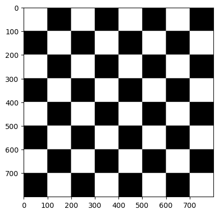
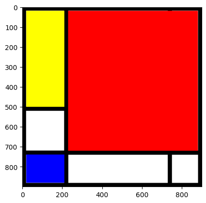
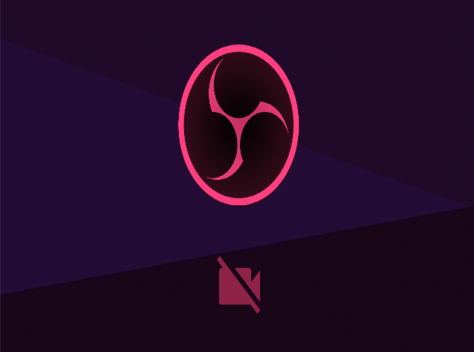
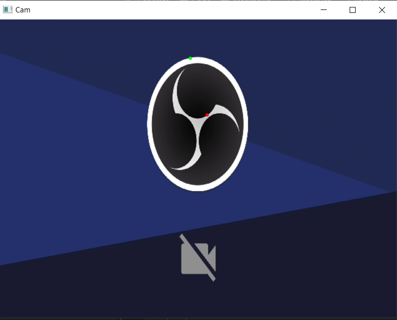
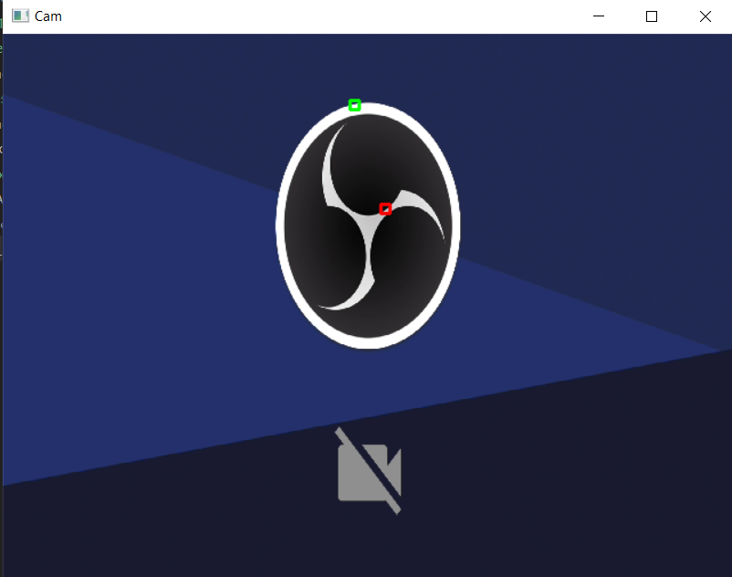
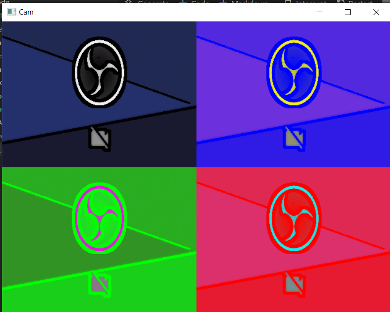

<div style="center">

[]()


---


</div>


# Práctica 1 de la asignatura Visión por computador.

<details>
<summary><b>📚 Tabla de contenidos</b></summary>


- [Primeros pasos: instalación del entorno](#primeros-pasos-instalación-del-entorno)
- [Tarea 1](#tarea-1--crea-una-imagen-pe-de-800x800-píxeles-con-la-textura-del-tablero-de-ajedrez)
- [Tarea 2](#tarea-2-crear-una-imagen-estilo-mondrian-un-ejemplo-httpswww3gobiernodecanariasorgmedusaecoescuelasa20170417descubriendo-a-mondrian--con-las-funciones-de-dibujo-de-opencv)
- [Tarea 3](#tarea-3-modifica-de-forma-libre-los-valores-de-un-plano-de-la-imagen)
- [Tarea 4](#tarea-4-pintar-círculos-en-las-posiciones-del-píxel-más-claro-y-oscuro-de-la-imagen-si-quisieras-hacerlo-sobre-la-zona-8x8-más-claraoscura)
- [Tarea 5](#tarea-5-llevar-a-cabo-una-propuesta-propia-de-pop-art)
- [autores y reconocimientos](#autores-y-reconocimiento)

</details>

## Primeros pasos: instalación del entorno

Para poder desarrollar y visualizar esta práctica debemos de, primero, de preparar el entorno de desarrollo. Para ello, podemos seguir la práctica adjuntada por el docente de la asigntura:

[enlace del github de la páctica](https://github.com/otsedom/otsedom.github.io/blob/main/VC/P1/README.md)

Un breve resumen, sería:
- Instalar Anaconda, matplotlib y opecv
- activar el entorno virtual 
- Descargar los archivos de la práctica
- Instalar Python para VSCode
- Escoger el environment del entorno


----
## **Tarea 1**:  Crea una imagen, p.e. de 800x800 píxeles, con la textura del tablero de ajedrez

El código desarrollado es el siguiente:

```py
alto = 800
ancho = 800
gris_img = np.zeros((alto,ancho,1), dtype = np.uint8)
lado = 100

for fila in range(0, alto, lado):
    for col in range(0, ancho, lado):
        if ((fila // lado) + (col // lado)) % 2 == 0:
            gris_img[fila:fila+lado, col:col+lado, 0] =  255 # casilla blanca

plt.imshow(gris_img, cmap='gray')
plt.show()
```
Para este ejercicio hemos establecido un tablero de ajedrez de lado 800 x 800px creando una matriz de todo ceros en escala de grises. 
A su vez, declaramos el lado de nuestros cuadrados.

Aquí realizamos un pequeño desglose:

```py
alto = 800
ancho = 800
gris_img = np.zeros((alto,ancho,1), dtype = np.uint8)
lado = 100
```

Ahora usamos dos bucles para poder recorrer las filas y las columnas. además "pinta" de forma iterativa entre blanco y negro gracais a la línea ` gris_img[fila:fila+lado, col:col+lado, 0] = 255`  ya que previamente comprueba si ese cuadro del tablero es par o impar para alternar los colores de la siguiente manera:

- Si la suma de la fila y la columna es par, el cuadrado se rellenará de color blanco.
- Si no, se quedará negro.

Por último queda la visualización:

```python
plt.imshow(gris_img, cmap='gray')
plt.show()
```
- `plt.imshow(gris_img, cmap='gray')`: usa matplotlib para mostrar la matriz gris_img como una mapa, forzandolo a que se use escalas de grises.

- `plt.show()`: muestra la imagen renderizada.

### Resultados:

----

## **Tarea 2**: Crear una imagen estilo Mondrian (un ejemplo https://www3.gobiernodecanarias.org/medusa/ecoescuela/sa/2017/04/17/descubriendo-a-mondrian/ ) con las funciones de dibujo de OpenCV

El código desarrollado es el siguiente:

```python
tamaño = 900
#Crea una imagen con tres planos
color_img = np.ones((tamaño,tamaño,3), dtype = np.uint8) * 255

#Borde negro -> Cuadrado con grosor 30
cv2.rectangle(color_img,(0,0),(tamaño,tamaño),(0,0,0),35)

#Línea negra vertical larga 
cv2.line(color_img,(220,0),(220,tamaño),(0,0,0),20)

#Línea negra horizontal larga
cv2.line(color_img,(0,730),(900,730),(0,0,0),20)

#Línea negra horizontal límite rectángulo amarillo y cuadrado blanco 
cv2.line(color_img,(0,510),(210,510),(0,0,0),20)

#Línea negra vertical límite rectángulo blanco y cuadrado blanco
cv2.line(color_img,(740,0),(740,900),(0,0,0),20)

#Rectángulo relleno amarillo
cv2.rectangle(color_img,(20,20),(210,500),(255,255,0),-1)

#Rectángulo relleno rojo
cv2.rectangle(color_img,(230,20),(880,720),(255,0,0),-1)

#Rectángulo relleno azul
cv2.rectangle(color_img,(20,740),(210,880),(0,0,255),-1)

#Círculo de radio 15 relleno
#cv2.circle(color_img,(ancho-60,30), 15, (0,0,255), -1)
#Visualiza sin especificar el mapa de color gris

plt.imshow(color_img) 
plt.show()

#Salva la imagen resultante a disco
cv2.imwrite('imagen.jpg', color_img)

```

En este caso hay varios fragmentos de código repetidos, por lo que explicaremos brevemente las funciones de forma única:

```py
tamaño = 900
#Crea una imagen con tres planos
color_img = np.ones((tamaño,tamaño,3), dtype = np.uint8) * 255
```
Crea una imagen cuadrada de *tamaño x tamaño* px. Con los tres canales de color (RGB). Se inicializa en 1 y se mutiplica ese valor por 255 dando un lienzo en blanco.

```py 
cv2.rectangle(color_img,(20,740),(210,880),(0,0,255),-1)
```

La función de opencv rectangle crea un rectangulo y tiene la siguiente forma:

`cv2.rectangle(source, pt1, pt2, color, grosor)`

vamos a desglosar los argumentos:

- `source`: es la imagen que vamos a modficar.
- `pt1`: son las coordenadas de la esquina superior izquierda del rectángulo.
- `pt2`:  son las coordenadas de la esquina inferior derecha del rectángulo.
- `color`: es el color que va a tomar el rectangulo en formato RGB.
- `grosor` (o en ingles *thickness*) : es el grosor de las líneas que dibujan el triangulo 

```py
cv2.line(color_img,(0,730),(900,730),(0,0,0),20)
```

La función de opencv line crea una línea recta de la siguiente forma:

`cv2.line(source, pt1, pt2, color, grosor)` 

Vamos a desglosar los argumentos:
- `source`: es la imagen que vamos a modficar.
- `pt1`: son las coordenadas del punto de inicio de la recta
- `pt2`:  son las coordenadas del punto de fin de la recta.
- `color`: es el color que va a tomar el rectangulo en formato RGB.
- `grosor` (o en ingles *thickness*) : es el grosor de la línea.

### Resultados:



## **Tarea 3**: Modifica de forma libre los valores de un plano de la imagen.

El código desarrollado es el siguiente:


```py
vid = cv2.VideoCapture(0)
import random
counter = 0
while(True):      
    # fotograma a fotograma
    ret, frame = vid.read()

    if ret:
        #Separamos canales
        b = frame[:,:,0]//random.randint(1,4)
        g = frame[:,:,1]//random.randint(1,4)
        r = frame[:,:,2]//random.randint(1,4)
        #Dimensiones imagen de entrada
        h, w, c = frame.shape
        #Concateamos en horizontal los tres planos del fotograma
        collage = cv2.merge((b, g, r))
        if counter >= 150 and counter < 300:
            collage = cv2.flip(collage, 1)
        if counter >= 300:
            counter = 0
        counter += 1
        # Muestra fotograma redimensionando a la mitad para que quepa en pantalla
        cv2.imshow('RGB', cv2.resize(collage, (int(w),int(h)),cv2.INTER_NEAREST))
    
    # Detenemos pulsado ESC
    if cv2.waitKey(20) == 27:
        break
  
# Libera el objeto de captura
vid.release()
# Destruye ventanas
cv2.destroyAllWindows()
```

Vamos a desglosarlo:

```py
vid = cv2.VideoCapture(0)
```

Abre la primera cámara que capte el ordenador. Si no fuera la 0 se puede sustituir por 1, 2 o 3.

```py
ret, frame = vid.read()
```

- `ret`: nos indica si la captura ha ido bien.
- `frame`: contiene la imagen que capta la imagen.

```py
        b = frame[:,:,0]//random.randint(1,4)
        g = frame[:,:,1]//random.randint(1,4)
        r = frame[:,:,2]//random.randint(1,4)
```
Separa los canales y los divide por un valor aleatorio entre 1 y 4. Como se actualiza de forma constante, cambia de color de forma aleatoria cada vez que se actualiza la cámara.

```py
        collage = cv2.merge((b, g, r))
```

Vuelve a unir los canales de color de la imagen.


```py
if counter >= 150 and counter < 300:
    collage = cv2.flip(collage, 1)
if counter >= 300:
    counter = 0
counter += 1
```

Usa la función flip de cv2 que invierte en el eje horizontal la imagen cada 150 frames.

```py
cv2.imshow('RGB', cv2.resize(collage, (int(w),int(h)), cv2.INTER_NEAREST))
```

Muestra el frame, a su tamaño original, y reescala mediante el método de aproximación del vecino más cercano.

```py
if cv2.waitKey(20) == 27:
    break
```

sale del bucle de lectura de cámara. Espera 20 milisegundos por cada frame y si se pulsa escape sale.

```py
vid.release()
cv2.destroyAllWindows()
```

Libera y cierra la cámara.



## **Tarea 4**: Pintar círculos en las posiciones del píxel más claro y oscuro de la imagen ¿Si quisieras hacerlo sobre la zona 8x8 más clara/oscura?

El código desarrollado es el siguiente:

```py
vid = cv2.VideoCapture(0)

# Tipografía para mostrar texto
font = cv2.FONT_HERSHEY_SIMPLEX
  
px = -1
while(True):      
    # fotograma a fotograma
    ret, frame = vid.read()

    if ret: 

        gray_scale = cv2.cvtColor(frame, cv2.COLOR_BGR2GRAY)
        h, w = gray_scale.shape
        lightnest = np.argmax(gray_scale) 
        darkest = np.argmin(gray_scale)

        index_darkest_y, index_darkest_x = divmod(darkest, w)
        index_lightnest_y, index_lightnest_x = divmod(lightnest, w)

        cv2.circle(frame, (int(index_darkest_x), int(index_darkest_y)), 1, (0, 0, 255),2)
        cv2.circle(frame, (int(index_lightnest_x), int(index_lightnest_y)), 1, (0, 255, 0), 2)
        cv2.imshow('Cam', frame)

            

        
    # Detenemos pulsado ESC
    if cv2.waitKey(20) == 27:
        break
  
# Libera el objeto de captura
vid.release()
# Destruye ventanas
cv2.destroyAllWindows()
```
Desglosando, vemos que hay elementos que hemos visto en otras tareas. 

```python
        gray_scale = cv2.cvtColor(frame, cv2.COLOR_BGR2GRAY)
```
Convierte a escalas de grises las imagenes, esto facilita la búsqueda y cálculo de máximos y mínimos

```py
        lightnest = np.argmax(gray_scale) 
        darkest = np.argmin(gray_scale)
```

gracias a *argmax* y *argmin* de la librería *numpy* podemos encontrar los valores más claros y oscuros en una imagen de forma sencilla y rápida. Gracias a la conversión anterior, ya que de no haber usado esta función anterior, con está el tiempo de cálculo y búsqueda son bastante altos. Ya que numpy usa funciones directamente del núcleo para sus cálculos, acelerando el proceso.

Se puede ver más información sobre estas funciones en [numpy](https://numpy.org/doc/2.0/reference/generated/numpy.argmax.html), o en el propio [repositorio](https://github.com/numpy/numpy/blob/v2.0.0/numpy/_core/fromnumeric.py#L1208-L1298) donde se puede ver como se desarrollo.

```python
        index_darkest_y, index_darkest_x = divmod(darkest, w)
        index_lightnest_y, index_lightnest_x = divmod(lightnest, w)
```

Caluclo de las coordenadas de los puntos más oscuros y claros.

Finalmente mostramos el resultado calculado en la imagen en blanco y negro, sobre la imagen a color.

### Resultado:



### Parte 2: de un cuadrado de 8x8 pixeles en vez de un circulo de 1 pixel

El código desarrollado es el siguiente: 
```python
vid = cv2.VideoCapture(0)

  
px = -1
while(True):      
    # fotograma a fotograma
    ret, frame = vid.read()

    if ret: 

        gray_scale = cv2.cvtColor(frame, cv2.COLOR_BGR2GRAY)
        h, w = gray_scale.shape
        sums_8x8 = cv2.boxFilter(gray_scale, ddepth=-1, ksize=(8, 8), normalize=False, borderType=cv2.BORDER_REFLECT101)
        
        lightest_idx = np.argmax(gray_scale)
        darkest_idx  = np.argmin(gray_scale)
        cy_light, cx_light = divmod(lightest_idx, w)
        cy_dark,  cx_dark  = divmod(darkest_idx,  w)

        tlx_light = min(max(cx_light - 4, 0), w - 8)
        tly_light = min(max(cy_light - 4, 0), h - 8)
        tlx_dark  = min(max(cx_dark  - 4, 0), w - 8)
        tly_dark  = min(max(cy_dark  - 4, 0), h - 8)

        cv2.rectangle(frame, (tlx_dark,  tly_dark),  (tlx_dark  + 8, tly_dark  + 8), (0,   0, 255), 2) # rojo: más oscuro
        cv2.rectangle(frame, (tlx_light, tly_light), (tlx_light + 8, tly_light + 8), (0, 255,   0), 2) # verde: más claro
        cv2.imshow('Cam', frame)

            

```
En este caso el código es muy similar al anterior, así que solo comentaremos las piezas clave:

```python
        sums_8x8 = cv2.boxFilter(gray_scale, ddepth=-1, ksize=(8, 8), normalize=False, borderType=cv2.BORDER_REFLECT101)
```

`boxFilter(src, ddepth, ksize, normalize, borderType)`:

- `src`: imagen sobre la que vamos a editar.
- `ksize`: define la ventana local (el cuadrado).
- `normalize`: en este caso devuelve la suma de intensidades. Si se usase con True devolvería la media.
- `ddepth`:  Conservir el tipo de dato.
- `borderType`: manejo de bordes, en este caso, para la reflexión.

```python
        tlx_light = min(max(cx_light - 4, 0), w - 8)
        tly_light = min(max(cy_light - 4, 0), h - 8)
        tlx_dark  = min(max(cx_dark  - 4, 0), w - 8)
        tly_dark  = min(max(cy_dark  - 4, 0), h - 8)
```

Son bloques de control asegurandose que se centre en el pixel centrado, o que no se sobresalga por ningún lado ni negativo ni positivo de la imagen.

### Resultados:




## **Tarea 5**: Llevar a cabo una propuesta propia de pop art

```python
vid = cv2.VideoCapture(0)

#Dimensiones de la cámara
w = int(vid.get(cv2.CAP_PROP_FRAME_WIDTH))
h = int(vid.get(cv2.CAP_PROP_FRAME_HEIGHT))

#Fuerzo a mitad de resolución para ocupar menos pantalla
w=int(w/2)
h=int(h/2)
vid.set(cv2.CAP_PROP_FRAME_WIDTH, w) #En Mac no reacciona a estos comandos
vid.set(cv2.CAP_PROP_FRAME_HEIGHT, h)

#Imagen conjunta 2x original
collage = np.zeros((h*2,w*2,3), dtype = np.uint8)
tl = collage[0:h,0:w]
tr = collage[0:h,w:w+w]
bl = collage[h:h+h,0:w]
br = collage[h:h+h,w:w+w]

while True:      
    # fotograma a fotograma
    ret, frameIN = vid.read()

    #Menor tamaño
    frame = cv2.resize(frameIN, (int(w),int(h)),cv2.INTER_AREA)
    
    if ret:
        gray = cv2.cvtColor(frame, cv2.COLOR_BGR2GRAY)
        gray_scale = cv2.medianBlur(gray, 3)
        edges = cv2.adaptiveThreshold(gray_scale, 255,cv2.ADAPTIVE_THRESH_MEAN_C,cv2.THRESH_BINARY, 11, 2)
        colour = cv2.bilateralFilter(frame, 9, 300, 300)
        cartoon = cv2.bitwise_and(colour, colour, mask=edges)
        
        #Separamos canales
        r = cartoon[:,:,2]
        g = cartoon[:,:,1]
        b = cartoon[:,:,0]

        #Jugamos con los valores de los planos
        tl[:,:,0] = b
        tl[:,:,1] = g
        tl[:,:,2] = r

        tr[:,:,0] = 255 - r
        tr[:,:,1] = g
        tr[:,:,2] = b
        
        bl[:,:,0] = r
        bl[:,:,1] = 255 - b
        bl[:,:,2] = g

        br[:,:,0] = b
        br[:,:,1] = g
        br[:,:,2] = 255 - r
    
        # Muestra composición
        cv2.imshow('Cam', collage)


    
    # Detenemos pulsado ESC
    if cv2.waitKey(20) == 27:
        break
  
# Libera el objeto de captura
vid.release()
# Destruye ventanas
cv2.destroyAllWindows()
```

Esto es lo que hemos añadido:

```python
gray = cv2.cvtColor(frame, cv2.COLOR_BGR2GRAY)
gray_scale = cv2.medianBlur(gray, 3)
edges = cv2.adaptiveThreshold(gray_scale, 255,
                              cv2.ADAPTIVE_THRESH_MEAN_C,
                              cv2.THRESH_BINARY, 11, 2)
colour = cv2.bilateralFilter(frame, 9, 300, 300)
cartoon = cv2.bitwise_and(colour, colour, mask=edges)
```

En este caso, hemos convertido en gris una imagen como hicimos en el caso de los claros y oscuros, y sobre ella hemos aplicado los siguientes filtros:

- `medianBlur`: Suavizado de ruido para definir mejor los bordes.
- `adaptativeThreshold`: Crea bordes tipo comic.
- `bilateralFilter`: suaviza pero conserva los bordes, aumentando el efecto tipo ilustración
- `bitwise_and`: aplica los bordes detectados a la imagen que se ha suavizado antes.

### Resultado:


--- 
## Autores y Reconocimiento

<div align="center">

[](https://github.com/lumusa2design)

[](https://github.com/guillecab7)

[](https://github.com/otsedom)

[](https://www.eii.ulpgc.es/es)

</div>


